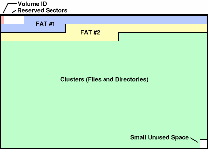
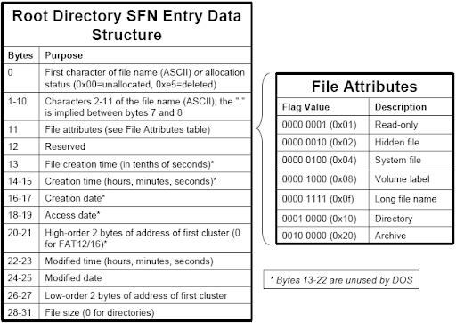

# file-system-based strcmp go brrrr

We are given a FAT32 filesystem file strcmp.fat32

```
➜  plaid> fatcat strcmp.fat32 -i            
FAT Filesystem information

Filesystem type: fat32   
OEM name: strcmp  
Total sectors: 66057
Total data clusters: 65664
Data size: 33619968 (32.0625M)
Disk size: 33821184 (32.2544M)
Bytes per sector: 512
Sectors per cluster: 1
Bytes per cluster: 512
Reserved sectors: 8
Sectors per FAT: 513
Fat size: 262656 (256.5K)
FAT1 start address: 0000000000001000
FAT2 start address: 0000000000041200
Data start address: 0000000000041200
Root directory cluster: 2
Disk label: 

Free clusters: 126/65664 (0.191886%)
Free space: 64512 (63K)
Used space: 33555456 (32.001M)

```

Trying to navigate it using `fatcat strcmp.fat32 -l /` we got to know that every directory contains subdirectories for each character and then a 
file at the end indicating if the strcmp is matched or not.
Files were `SORRY TOOBAD NOFLAG4U NOMATCH NEGATORY LOLNOPE TROLLOL and finally MATCH`

So reading about the FAT32 file structure





```
Sector =  ((N – 2) * BPB_SecPerClus) + FirstDataSector;
```

The root directory starts at N=2, so information about the root directory should be stored at first sector index that we can get from the earlier info `Data start address: 0000000000041200`
`FirstDataSector = 521`

So, the plan was to start reading at N=2 and then continue (not follow) reading the entire file for directory table entries.
The directory table is of the following structure.





```
def parse_fat_directory_row(chunk_32):
    x = struct.unpack("<11sccchhhhhhhI",chunk_32)
    name = x[0].decode("utf-8").strip()
    location = x[7] + x[10]
    return (name,location)
 ```
 
Now we find all the files that are named MATCH and backtrack using the mapping the mapping created during parsing the directory table
```
def s(N):
    return ((N-2) + 521)*512

def read_directory(fat,sector_index):
    dir_index = sector_index
    while s(sector_index) <= len(fat):
        if (sector_index - 2) % 4 == 0:
            dir_index = sector_index
        sector_start = s(sector_index)
        sector_end = sector_start + SECTOR_SIZE
        current_sector = fat[sector_start:sector_end]
        if sector_index not in dir_tree.keys():
            dir_tree[sector_index] = []
        for chunk in split_chunk(current_sector,32):
            if chunk != b'\x00'*32:
                parsed = parse_fat_directory_row(chunk)
                parsed += (dir_index,)
                next_chunk_location = parsed[2]
                dir_tree[sector_index].append(parsed[2])
                if next_chunk_location not in reverse_mapping.keys():
                    reverse_mapping[next_chunk_location] = []
                if parsed not in reverse_mapping[next_chunk_location]:
                    reverse_mapping[next_chunk_location].append(parsed)
                positions[sector_index] = parsed
        sector_index += 1
 ```
But for some reason that just gave me half the flag.

So I started thinking of alternate approaches. I knew the flag started with `PCTF{` and I was under the assumption that only one path will lead to a
correct strcmp, so why don't I make a blacklist of all the locations that I know I should not go to, for example at directory `/` I knew the next directory was `P` so all other next locations were blacklisted.
Doing so my options at the end of `/P/C/T/F/{/` would only be handful that I can search recursively.

```
def next_opts(fat,sector_index):
    i = sector_index
    opts = []
    while s(sector_index) <= len(fat):
        sector_start = s(sector_index)
        sector_end = sector_start + SECTOR_SIZE
        current_sector = fat[sector_start:sector_end]
        for chunk in split_chunk(current_sector,32):
            if chunk != b'\x00'*32:
                parsed = parse_fat_directory_row(chunk)
                opts.append(parsed)
        sector_index += 1
        if sector_index - i == 4:
            return opts


def find_flag(fat,start_flag=['P','C','T','F','{']):
    next=2
    opts = []
    for x in start_flag:
        for opt in next_opts(fat,next):
            if opt[0] == x:
                next = opt[2]
            opts.append(opt[2])
    for opt in next_opts(fat,next):
        if opt[1] not in opts:
            new_start_flag = start_flag + [opt[0]]
            print("".join(new_start_flag))
            if opt[0] != "}":
                options_for_x(fat,start_flag=new_start_flag)

```

I got the flag

```
PCTF{WHAT_IN_TARNATION_IS_TH1S_FI
PCTF{WHAT_IN_TARNATION_IS_TH1S_FIL
PCTF{WHAT_IN_TARNATION_IS_TH1S_FILE
PCTF{WHAT_IN_TARNATION_IS_TH1S_FILES
PCTF{WHAT_IN_TARNATION_IS_TH1S_FILESY
PCTF{WHAT_IN_TARNATION_IS_TH1S_FILESYS
PCTF{WHAT_IN_TARNATION_IS_TH1S_FILESYSP
PCTF{WHAT_IN_TARNATION_IS_TH1S_FILESYSPC
PCTF{WHAT_IN_TARNATION_IS_TH1S_FILESYSPCT
PCTF{WHAT_IN_TARNATION_IS_TH1S_FILESYSPCTF
PCTF{WHAT_IN_TARNATION_IS_TH1S_FILESYSPCTF{
PCTF{WHAT_IN_TARNATION_IS_TH1S_FILESYST
PCTF{WHAT_IN_TARNATION_IS_TH1S_FILESYSTE
PCTF{WHAT_IN_TARNATION_IS_TH1S_FILESYSTEM
PCTF{WHAT_IN_TARNATION_IS_TH1S_FILESYSTEM!
PCTF{WHAT_IN_TARNATION_IS_TH1S_FILESYSTEM!}
```
